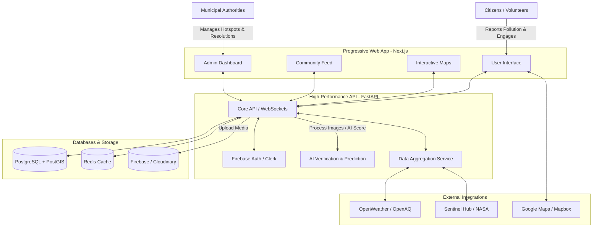

# 🌍 ENVISION AI

**Hyperlocal Environmental Intelligence Platform**

ENVISION AI is a real-time environmental social platform where citizens, artificial intelligence, satellite imagery, IoT sensors, and local authorities work together to identify, predict, and solve environmental problems before they become disasters.

## 🚀 Vision & Mission

Our goal is to create India's largest community-driven environmental intelligence network. We enable anyone to:
- Report pollution in seconds
- View live environmental conditions (AQI, PM2.5, Weather, etc.)
- Receive AI-powered alerts
- Assist municipalities in solving issues faster
- Participate in community action and plantation drives

---

## 🏗️ Architecture & Tech Stack

ENVISION AI is built with modern, scalable technologies prioritizing real-time responsiveness and high accessibility.

### **Graphical Architecture**

### **Frontend** (Progressive Web App)
- **Framework:** Next.js & React
- **Language:** TypeScript
- **Styling:** Tailwind CSS & Framer Motion (for premium animations)
- **Maps:** Google Maps / Mapbox

### **Backend** (High-Performance API)
- **Framework:** FastAPI
- **Language:** Python
- **Database:** PostgreSQL with PostGIS (for spatial data and heatmaps)
- **Caching & Real-time:** Redis & WebSockets
- **Authentication:** Firebase Auth / Clerk
- **Storage:** Firebase Storage / Cloudinary

### **Integrations & AI**
- **Live Data:** OpenWeather API, OpenAQ, NASA Earth Data, Sentinel Hub
- **AI Processing:** Image recognition for automated verification of pollution reports (smoke, dust, waste, etc.), predictive modeling for AQI and pollution spread.

---

## 🔄 System Flow

1. **Reporting & AI Verification Flow**
   - **User** captures an environmental issue (e.g., garbage burning) via the mobile-first PWA.
   - **Upload** includes images/videos, GPS location, and voice/text description.
   - **AI Verification** automatically analyzes the media to detect smoke, fire, waste, etc., assigning a "confidence/trust score".
   - Verified reports appear on the **Live Map** and **Community Feed**.

2. **Community & Engagement Flow**
   - Users view an Instagram-style **Home Feed** with community posts, verified reports, and events.
   - Engagement features: Like, Comment, Share, Polls, and Stories.
   - **Gamification:** Users earn "Eco Points" for valid reports and participating in events, updating the **Leaderboard**.

3. **Municipal Resolution Flow**
   - Local authorities access a dedicated **Municipality Dashboard**.
   - Officials view a heatmap of hotspots and newly verified reports.
   - Teams are dispatched to resolve issues, and reports are marked as "Resolved".
   - The original reporter and nearby community members receive real-time push **Notifications**.

4. **Data Aggregation & Live Map Flow**
   - The backend aggregates data from IoT sensors, satellite imagery APIs, and citizen reports.
   - The **Interactive Map** overlays AQI, pollution heatmaps, and user reports.
   - AI algorithms predict 24-hour AQI trends and hotspot formations.

---

## 📂 Project Structure

- `/frontend` - Next.js web application
- `/backend` - FastAPI server and AI services
- `MASTER_PRD.md` - Complete Product Requirements Document detailing all features, UI/UX philosophy, and future roadmap.

## 🤝 Contributing
Contributions are welcome! We are building a community-driven open platform. Please read `MASTER_PRD.md` for our design philosophy and rules before submitting pull requests.

## 📄 License
[Add License Here]
